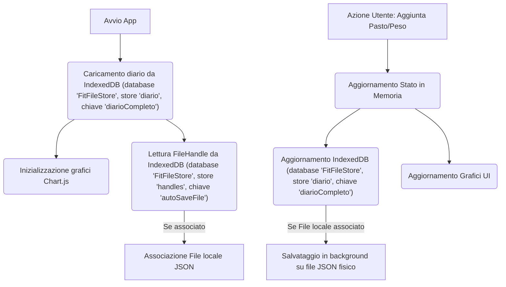

# AI NutriTracker

**AI NutriTracker** è un'applicazione web single-page (SPA) moderna, ultra-leggera e focalizzata sulla privacy per il tracciamento alimentare, il monitoraggio dei macronutrienti e il controllo del peso corporeo, integrata con le capacità avanzate di intelligenza artificiale offerte da **Gemini API (modello gemini-2.5-flash)**.

Il tool è sviluppato con una filosofia **offline-first**: tutti i dati e le chiavi API vengono memorizzati esclusivamente in locale sul browser del dispositivo dell'utente. Il diario alimentare storico viene salvato in **IndexedDB** per superare i limiti di spazio (5MB) del browser e ospitare anni di analisi, mentre le preferenze di base e la chiave API risiedono in `localStorage`, offrendo un controllo assoluto sulla propria privacy senza richiedere database esterni o server di terze parti.

---

## 🌟 Caratteristiche Principali

### 1. Tracciamento Alimentare Intelligente
* **Inserimento in Linguaggio Naturale**: Permette di descruire i pasti in linguaggio libero (es. *"Stamattina ho fatto colazione con 150g di yogurt greco, una manciata di noci e un caffè"*). L'intelligenza artificiale estrae automaticamente calorie e macronutrienti (Proteine, Carboidrati, Grassi).
* **Dettatura Vocale**: Icona microfono integrata per dettare i pasti a voce direttamente nei campi di testo tramite Web Speech API.
* **Correzione e Ricalcolo**: Possibilità di modificare qualsiasi pasto salvato tramite un pannello di controllo modale, con opzione di ricalcolo tramite AI o correzione manuale immediata.

### 2. Monitoraggio del Peso Corporeo
* Inserimento rapido del peso corporeo associato a date specifiche.
* Visualizzazione dei target di peso e calcolo delle medie mobili per valutare l'andamento reale.

### 3. Valutazioni e Pareri AI in Tempo Reale
* **Analisi Giornaliera**: Un pulsante dedicato analizza i pasti inseriti oggi rispetto ai target di calorie e macro impostati. Suggerisce spuntini mancanti o modifiche per il resto del giorno, evitando consigli ridondanti.
* **Analisi dei Trend Storici**: Esamina l'andamento incrociato a breve termine (ultimi 7 giorni) e medio termine (ultime 8 settimane) inviando solo i valori numerici aggregati (a tutela della privacy) per generare un report discorsivo e motivazionale strutturato in:
  * *Breve Periodo* (Calorie e macro recenti)
  * *Medio Periodo* (Andamento peso vs target)
  * *Consiglio Pratico* (Azione immediata per ottimizzare la costanza)

### 4. Grafici Interattivi e Storico
* Grafici dinamici (sviluppati con **Chart.js**) per analizzare l'andamento di calorie, proteine, carboidrati, grassi e peso.
* Suddivisione dell'andamento storico in tre comode viste: **Giorni** (ultimi 7 giorni), **Settimane** (ultime 8 settimane) e **Mesi** (ultimi 12 mesi).
* **Calcolo Medie Complessive Uniforme**: Nei diagrammi ad anello, le medie globali delle calorie e dei macronutrienti sono calcolate considerando esclusivamente i giorni con dati inseriti (escludendo i giorni vuoti), garantendo che i dati di riepilogo siano sempre accurati ed allineati con i grafici.
* **Registro Alimentare**: Mostra gli inserimenti storici organizzati cronologicamente con filtri di ricerca (testuale, mese e anno). I dettagli nutrizionali analitici stimati dall'AI sono contratti di default e visualizzabili singolarmente al clic per massimizzare la pulizia visiva, mentre i comandi di manutenzione del database sono raggruppati in un'unica barra degli strumenti compatta.

### 5. Pannello Impostazioni Avanzato
Il pannello impostazioni è organizzato in sezioni espandibili (accordion) per la massima pulizia visiva:
*🔑 **Gemini API Key**: Per inserire la propria chiave d'accesso personale.
*🎯 **Target Giornalieri**: Definizione dei target di peso, calorie, proteine, carboidrati e grassi, con controlli automatici di coerenza (le calorie totali devono corrispondere alla somma dei macronutrienti).
*🌾 **Calcola Target con AI**: Compilazione assistita del profilo utente (sesso, età, peso attuale, peso desiderato, livello di attività e obiettivo) con calcolo scientifico e note personalizzate sulla sostenibilità del target stimate dall'AI.
*💾 **Salvataggio Locale**: Associazione a un file JSON fisico sul dispositivo tramite *File System Access API* per il backup e salvataggio automatico persistente in background ad ogni modifica del diario.

---

## 🔒 Sicurezza e Gestione dei Token

L'applicazione è progettata per essere efficiente in termini di costi e consumo delle API:
* **Gestione Risposte AI**: Le risposte dell'AI sono mantenute concise e strutturate grazie a precise regole e vincoli impostati nei prompt di sistema, senza definire un limite rigido di output (`maxOutputTokens`) al fine di evitare interruzioni o troncamenti imprevisti nel formato JSON o nel testo discorsivo.
* **Limitazione Input**: Entrambi i campi di testo del diario sono limitati nativamente a un massimo di **500 caratteri** (`maxlength`), impedendo l'inserimento di testi massivi che aumenterebbero i costi di chiamata.
* **Disclaimer Medici**: Note informative multilingua (Italiano/Inglese) integrate nelle impostazioni e nei box di risposta AI ricordano che le valutazioni fornite dall'AI non sostituiscono il parere di medici o nutrizionisti professionisti e che possono contenere errori.

---

## 🛠️ Stack Tecnologico

* **Frontend**: HTML5 Semantico, CSS3, Tailwind CSS (Styling reattivo e moderno con palette HSL in dark-mode).
* **Grafica e Visualizzazione**: Chart.js (Grafici andamento e indicatori radiali ad anello).
* **Icone**: Lucide Icons.
* **Motore AI**: Google Gemini API (`gemini-2.5-flash`).
* **Storage**: **IndexedDB** (per il diario storico, per rimuovere i limiti di memoria), Web Storage API (`localStorage` per le impostazioni) & File System Access API (Salvataggio automatico sul disco locale).

---

## ⚙️ Architettura e Dettagli Tecnici

### 1. Schema Dati (JSON)
L'applicazione gestisce un database relazionale fittizio serializzato in un singolo array JSON. Ogni giorno (`GiornoEntry`) ha la seguente struttura:

```json
{
  "id": 1720272000000,
  "data": "2026-07-06",
  "calorie": 2150,
  "proteine": 145,
  "carboidrati": 220,
  "grassi": 72,
  "peso": 74.5,
  "pasti": [
    {
      "id": 1720272005000,
      "ora": "08:30",
      "testo": "Colazione con 150g yogurt greco e noci",
      "calorie": 250,
      "proteine": 20,
      "carboidrati": 10,
      "grassi": 12
    }
  ],
  "analisiAI": "Valutazione testuale salvata per evitare ricalcoli..."
}
```

### 2. Flusso del Ciclo di Vita dei Dati


### 3. Flussi di Integrazione AI
L'applicazione invia chiamate HTTP dirette (senza backend intermediario) verso gli endpoint di Google Generative Language. Di seguito i dettagli di tutte le 4 tipologie di chiamata implementate:

#### A. Stima Nutrizionale Pasti (`analizzaDatiConAI` / `salvaModifica`)
* **Scopo**: Tradurre una descrizione libera di un pasto in valori nutrizionali precisi.
* **Collocazione UI (Tab e Pulsante)**: 
  * **Nuovo Pasto**: Tab **Dati** (schermata principale dell'applicazione, sotto l'area di testo di input) $\rightarrow$ pulsante `"Elabora con AI"` (viola).
  * **Modifica Pasto**: Tab **Registro** (cliccando sulla matita `✏️` di un pasto per aprire il modale) $\rightarrow$ pulsante `"AI Ricalcola"` (con icona `✨` a destra della descrizione).
* **Input**:
  * Testo descrittivo del pasto (max 500 caratteri).
  * Profilo fisico utente (sesso, età, peso, altezza, target calorico) per la stima intelligente delle porzioni quando non specificate.
* **Prompt Integrale**:
  ```text
  Sei un nutrizionista esperto e analista dati. Analizza il testo dell'utente (pasto/alimenti) e calcola calorie e macro totali usando questo flusso di calcolo rigoroso:

  1. SCOMPOSIZIONE E FALLBACK: Isola ogni alimento. Se è un piatto complesso (es. lasagna), scomponilo negli ingredienti base. Usa i database CREA e BDA (IT), integrando con USDA (US), CIQUAL (FR), McCance (UK). Se un brand manca, usa l'analogia per categoria e scrivi "[stimato da categoria]" nel log. Se l'utente descrive cibo da asporto, fast food o piatti da ristorante (es. pizza, sushi, kebab, burger), applica un fattore di correzione commerciale aumentando la stima dei grassi totali del 20% rispetto alla controparte casalinga per compensare i condimenti professionali nascosti.
  2. PORZIONI E PROFILO: In assenza di pesi, stima porzioni standard SINU/LARN regolate sul profilo utente: sesso ${prof.sesso}, età ${prof.eta || '30'} anni, peso ${prof.peso || '75'} kg, altezza ${prof.altezza || '175'} cm, target ${prof.targetCalorie || '2000'} kcal. Traduci le unità di misura vaghe in grammi reali usando standard culinari precisi: 1 cucchiaio da cucina = 15g (10g per l'olio), 1 cucchiaino = 5g, 1 bicchiere = 200ml, 1 tazza = 250ml, 1 vasetto di yogurt = 125g.
  3. STATO E CONDIMENTI: Assumi che i pesi siano riferiti all'alimento CRUDO e al NETTO di scarti, salvo diversa specifica (es. applica conversioni se "cotto"). Se la preparazione richiede grassi (es. "in padella") non menzionati, aggiungi 5-10g di olio EVO e indicalo.
  4. CALCOLO E COERENZA: Calcola i macro di ogni ingrediente, sommali per i totali e verifica la coerenza matematica rigorosa: 4 kcal/g per carboidrati/proteine, 9 kcal/g per i grassi. I valori totali di calorie e macronutrienti nel JSON devono rispettare questa equazione con tolleranza zero: (Proteine * 4) + (Carboidrati * 4) + (Grassi * 9) = Calorie totali. Arrotonda i singoli valori di massimo 1-2 unità per far quadrare matematicamente il totale.

  FORMATO DI OUTPUT OBBLIGATORIO:
  Rispondi ESCLUSIVAMENTE con un oggetto JSON valido. NO blocchi di codice (no ```json), NO testi extra o spazi prima della parentesi {. Struttura esatta:

  {
    "_analisi_singoli_alimenti": "Elenco compatto di ogni alimento isolato/stimato, peso in grammi [crudo/cotto, stimato da categoria o condimento nascosto] e macro. Es: 'Pasta (cruda) 80g: 280kcal, 60C, 9P, 1G | Olio EVO (condimento stimato) 10g: 90kcal, 0C, 0P, 10G'",
    "calorie": 0,
    "proteine": 0,
    "carboidrati": 0,
    "grassi": 0
  }
  ```
* **Configurazione e Limiti**:
  * **Modello**: `gemini-2.5-flash`
  * **Configurazione**: `{ responseMimeType: "application/json", temperature: 0.2 }`

#### B. Consigli Nutrizionali Giornalieri (`ottieniConsigliAI`)
* **Scopo**: Fornire una valutazione rapida e suggerimenti pratici per completare la giornata alimentare corrente.
* **Collocazione UI (Tab e Pulsante)**: Tab **Dati** (all'interno del riquadro *"Totale di oggi"*, visibile quando ci sono pasti registrati) $\rightarrow$ pulsante `"Chiedi parere AI"` (pulsante con icona `✨` in alto a destra).
* **Input**:
  * Calorie e macro consumate oggi vs target impostati.
  * Elenco testuale di tutti i pasti registrati nella giornata (es. colazione, pranzo).
* **Prompt Integrale**:
  ```text
  Agisci come un esperto nutrizionista e trainer. Fai una brevissima valutazione sintetica e amichevole dei macronutrienti consumati oggi rispetto ai target dell'utente, dando suggerimenti pratici ed immediati su cosa mangiare o evitare per il resto della giornata.
  Dati di oggi:
  - Calorie: ${calorieConsumate} kcal consumate su un target di ${targetCalorie} kcal.
  - Proteine: ${proteineConsumate}g consumate su un target di ${targetProteine}g.
  - Carboidrati: ${carboConsumati}g consumati su un target di ${targetCarbo}g.
  - Grassi: ${grassiConsumati}g consumati su un target di ${targetGrassi}g.
  
  Pasti consumati oggi:
  ${pastiDellaGiornata}
  Orario attuale della richiesta: ${new Date().toLocaleTimeString('it-IT', {hour: '2-digit', minute:'2-digit'})}. Usa questo dato per capire se l'utente deve ancora fare uno spuntino, la cena, o se la giornata è conclusa (in tal caso, fornisci un bilancio finale e un consiglio per l'indomani).
  
  Analizza i pasti consumati oggi per comprendere il contesto (ad esempio, quali pasti principali come colazione, pranzo, cena o spuntini sono già stati effettuati, o l'orario e la tipologia di alimenti scelti) ed evita assolutamente di proporre pasti che sono già stati consumati (es. non suggerire un pranzo completo se l'utente ha già pranzato, o non suggerire pasta a cena se ha già raggiunto o superato i target di carbo). Fornisci invece spunti mirati per gli spuntini mancanti o per la cena/colazione qualora manchino all'appello.
  Rispondi in massimo 3 o 4 frasi, in modo molto compatto, usando elenchi puntati se necessario. Sii motivante.
  Usa una formattazione pulita: metti in grassetto i concetti chiave (es. **ottimo**, **mancano**, **attenzione**) ed evita introduzioni prolisse come "Come esperto nutrizionista...". Vai dritto al punto.
  ```
* **Configurazione e Limiti**:
  * **Modello**: `gemini-2.5-flash`
  * **Configurazione**: `{ temperature: 0.4 }` (risposta testuale concisa).

#### C. Generatore di Target Medici ed Energetici (`generaTargetConAI`)
* **Scopo**: Calcolare i target nutrizionali personalizzati partendo da dati anagrafici e obiettivi fisici.
* **Collocazione UI (Tab e Pulsante)**: Box **Impostazioni** (accessibile cliccando sull'ingranaggio `⚙️` in alto a destra) $\rightarrow$ sezione **"Calcola Target con AI"** $\rightarrow$ pulsante `"Calcola target"` (viola, in fondo al modulo).
* **Input**:
  * Peso attuale, peso desiderato (target), tempo stimato (settimane).
  * Genere, età, altezza.
  * Livello di attività/allenamento descritto e obiettivo principale.
* **Prompt Integrale**:
  ```text
  Sei un esperto nutrizionista e trainer sportivo. Calcola i target ideali giornalieri di calorie (kcal), proteine (g), carboidrati (g), grassi (g) e suggerisci un peso target (kg) indicativo basato sui dati dell'utente:
  - Sesso biologico: ${sesso === 'donna' ? 'Femmina' : 'Maschio'}
  - Età: ${eta} anni
  - Peso attuale: ${peso} kg
  - Peso target desiderato dall'utente: ${pesoTargetInput} kg
  - Tempo desiderato per raggiungere l'obiettivo: ${tempoSettimane} settimane
  - Altezza: ${altezza} cm
  - Stile di vita e livello di attività fisica: ${attivita}
  - Obiettivo principale: ${obiettivo}

  Rispondi ESCLUSIVAMENTE con un oggetto JSON valido (senza markdown, senza racchiuderlo in codice tipo ```json) contenente le seguenti chiavi: "calorie" (numero), "proteine" (numero), "carboidrati" (numero), "grassi" (numero), "pesoTarget" (numero), "nota" (stringa).

  Istruzioni per il calcolo e la risposta:
  1. Calcola accuratamente il TDEE (Total Daily Energy Expenditure) dell'utente utilizzando una formula nutrizionale scientifica standard (es. Mifflin-St Jeor o Harris-Benedict) basandoti rigorosamente su:
     - Sesso biologico (Maschio/Femmina)
     - Età (in anni)
     - Peso attuale (in kg)
     - Altezza (in cm)
     - Livello di attività fisica fornito.
  2. Il "pesoTarget" restituito deve essere possibilmente allineato a quello desiderato dell'utente se fornito.
  3. Calcola con precisione il deficit o surplus calorico giornaliero in base al tempo fornito (se presente):
     - Calcola la differenza di peso: Delta = Peso target desiderato - Peso attuale (in kg).
     - Sapendo che 1 kg di variazione di peso corporeo equivale a circa 7700 kcal, calcola il fabbisogno calorico totale necessario per la variazione: Totale_kcal = Delta * 7700.
     - Dividi questa quota per il numero di giorni totali del percorso (settimane * 7) per trovare la correzione calorica giornaliera teorica: Variazione_Giornaliera = Totale_kcal / (settimane * 7).
     - Applica questa Variazione_Giornaliera al TDEE calcolato al punto 1 (Calorie finali = TDEE + Variazione_Giornaliera).
     - ATTENZIONE: Se la Variazione_Giornaliera calcolata è irrealistica o non sicura per la salute (es. deficit calorico giornaliero richiesto superiore a 800-1000 kcal o surplus richiesto superiore a 500 kcal, o comunque tempistiche estreme come voler prendere 5 kg in 2 settimane), devi forzare una correzione di sicurezza portando la variazione calorica giornaliera effettiva entro limiti sani (deficit max 500-800 kcal, surplus max 300-500 kcal) e spiegare chiaramente nella "nota" che la tempistica originale era irrealistica e pericolosa e che i target calorici sono stati adattati di conseguenza per una progressione sana e sostenibile.
     - Se invece la variazione calcolata è realistica e sicura, applicala per intero e indica nella "nota" che il piano è sostenibile e ben calibrato.
  4. Calcola accuratamente i macronutrienti basandoti sui dati fisici dell'utente:
     - Proteine: circa 1.6-2.2g per kg di Peso attuale dell'utente (in base all'Obiettivo principale e all'attività).
     - Grassi: circa 0.8-1.0g per kg di Peso attuale dell'utente.
     - Carboidrati: per colmare le calorie rimanenti del target finale calcolato al punto 3 (es. (Calorie finali - (proteine * 4 + grassi * 9)) / 4).
  5. Nel campo "nota", scrivi una breve valutazione in lingua ${currentLang === 'en' ? 'inglese' : 'italiana'} sul realismo e la sostenibilità del target di peso in base alle settimane desiderate (se indicate). Se l'obiettivo di tempo non è realistico (es. perdere o prendere 5 o più kg in 1 mese o tempistiche eccessivamente rapide e pericolose), indicalo chiaramente nel campo "nota" inserendo all'inizio il simbolo di pericolo ⚠️ e spiegando perché (es. "⚠️ Attenzione: Aumentare/Perdere 5 kg in 4 settimane è irrealistico e pericoloso per la salute..."). Se è realistico o se non è indicato il tempo, scrivi una nota breve e incoraggiante.
  ```
* **Configurazione e Limiti**:
  * **Modello**: `gemini-2.5-flash`
  * **Configurazione**: `{ responseMimeType: "application/json", temperature: 0.2 }`

#### D. Analisi Storica e Trend (`analizzaTrendConAI`)
* **Scopo**: Analizzare l'andamento del peso e dei pasti su finestre a breve e medio termine per valutare i progressi.
* **Collocazione UI (Tab e Pulsante)**: Tab **Trend** (schermata dei grafici andamento) $\rightarrow$ pulsante circolare con icona `✨` (posizionato a sinistra della barra di selezione *Giorni / Settimane / Mesi*).
* **Input**:
  * Target attuali del profilo.
  * Dati a Breve Periodo: riassunto giornaliero numerico degli ultimi 7 giorni (data, calorie, macro, peso).
  * Dati a Medio Periodo: riassunto settimanale delle ultime 8 settimane (medie macro/peso).
* **Prompt Integrale**:
  ```text
  Sei un esperto nutrizionista clinico e trainer sportivo. Analizza l'andamento recente dei pasti e del peso corporeo dell'utente su due finestre temporali rispetto ai suoi target impostati.
  
  Target attuali dell'utente:
  - Calorie: ${targetCalorie} kcal
  - Proteine: ${targetProteine} g
  - Carboidrati: ${targetCarbo} g
  - Grassi: ${targetGrassi} g
  - Peso Target: ${pesoTarget} kg
  
  Dati a BREVE PERIODO (Ultimi 7 Giorni, di cui ${giorniRegistratiCount} con dati effettivi):
  ${datiBrevePeriodo}
  
  Dati a MEDIO PERIODO (Ultime 8 Settimane, di cui ${settimaneRegistrateCount} con dati effettivi):
  ${datiMedioPeriodo}
  
  REGOLE CRITICHE PER L'ANALISI:
  1. Sii sintetico ma esplicativo (massimo 2-3 frasi chiare per sezione).
  2. NON riportare analisi giorno per giorno o settimana per settimana. NON ripetere, elencare o citare date o dati specifici ricevuti, ma limitati a riassumere l'andamento globale con un tono costruttivo e motivante.
  3. Considera solo i giorni/settimane in cui ci sono delle registrazioni effettive.
  4. Se la costanza di inserimento è bassa, incoraggia brevemente l'utente a registrare con più regolarità.
  
  Fornisci una valutazione separata e compatta, strutturata esattamente come segue (massimo 2-3 frasi per sezione, usa il grassetto per i titoli):
  
  **Breve Periodo**: [Valutazione chiara e discorsiva sull'andamento calorico e macronutrienti recente].
  **Medio Periodo**: [Valutazione chiara e discorsiva sulla tendenza del peso rispetto al target].
  **Consiglio**: [Un suggerimento pratico, motivante e immediato per ottimizzare i progressi o la costanza].
  ```
* **Configurazione e Limiti**:
  * **Modello**: `gemini-2.5-flash`
  * **Configurazione**: `{ temperature: 0.3 }` (risposta strutturata in 3 blocchi).
  * **Nota**: I pasti testuali non vengono trasmessi a questo endpoint a salvaguardia della privacy dell'utente.

### 4. Gestione della Sincronizzazione File (File System Access API)
Quando l'utente attiva il salvataggio automatico:
1. Viene richiesta l'autorizzazione di scrittura per il file selezionato sul computer locale.
2. Il puntatore al file (`FileSystemFileHandle`) viene memorizzato su **IndexedDB** (nel database `'FitFileStore'`, all'interno dell'object store `'handles'`), poiché `localStorage` non può contenere oggetti complessi.
3. All'avvio dell'applicazione, viene tentato il ripristino silenzioso dell'autorizzazione.
4. Ad ogni scrittura sul diario, viene invocato un flusso asincrono che sovrascrive il file JSON locale con il database aggiornato, mantenendo allineato il backup.
