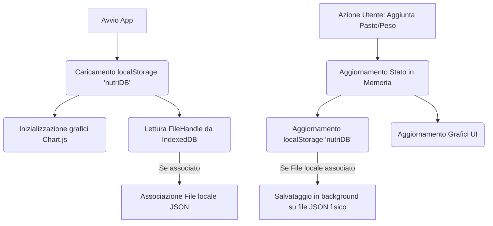

# AI NutriTracker

**AI NutriTracker** è un'applicazione web single-page (SPA) moderna, ultra-leggera e focalizzata sulla privacy per il tracciamento alimentare, il monitoraggio dei macronutrienti e il controllo del peso corporeo, integrata con le capacità avanzate di intelligenza artificiale offerte da **Gemini API (modello gemini-2.5-flash)**.

Il tool è sviluppato con una filosofia **offline-first**: tutti i dati e le chiavi API vengono memorizzati esclusivamente in locale sul browser del dispositivo dell'utente (`localStorage`), offrendo un controllo assoluto sulla propria privacy senza richiedere database esterni o server di terze parti.

---

## 🌟 Caratteristiche Principali

### 1. Tracciamento Alimentare Intelligente
* **Inserimento in Linguaggio Naturale**: Permette di descruire i pasti in linguaggio libero (es. *"Stamattina ho fatto colazione con 150g di yogurt greco, una manciata di noci e un caffè"*). L'intelligenza artificiale estrae automaticamente calorie e macronutrienti (Proteine, Carboidrati, Grassi).
* **Dettatura Vocale**: Icona microfono integrata per dettare i pasti a voce direttamente nei campi di testo tramite Web Speech API.
* **Correzione e Ricalcolo**: Possibilità di modificare qualsiasi pasto salvato tramite un pannello di controllo modale, con opzione di ricalcolo tramite AI o correzione manuale immediata.

### 2. Monitoraggio del Peso Corporeo
* Inserimento rapido del peso corporeo associato a date specifiche.
* Visualizzazione dei target di peso e calcolo delle medie mobili per valutare l'andamento reale.

### 3. Valutazioni e Pareri AI in Tempo Reale
* **Analisi Giornaliera**: Un pulsante dedicato analizza i pasti inseriti oggi rispetto ai target di calorie e macro impostati. Suggerisce spuntini mancanti o modifiche per il resto del giorno, evitando consigli ridondanti.
* **Analisi dei Trend Storici**: Esamina l'andamento incrociato a breve termine (ultimi 7 giorni) e medio termine (ultime 8 settimane) inviando solo i valori numerici aggregati (a tutela della privacy) per generare un report discorsivo e motivazionale strutturato in:
  * *Breve Periodo* (Calorie e macro recenti)
  * *Medio Periodo* (Andamento peso vs target)
  * *Consiglio Pratico* (Azione immediata per ottimizzare la costanza)

### 4. Grafici Interattivi e Storico
* Grafici dinamici (sviluppati con **Chart.js**) per analizzare l'andamento di calorie, proteine, carboidrati, grassi e peso.
* Suddivisione dell'andamento storico in tre comode viste: **Giorni**, **Settimane** e **Mesi**.
* **Registro Alimentare**: Mostra di default gli ultimi 30 giorni con scorrimento fluido. È presente un sistema di filtri (ricerca testuale per alimento, filtro per mese specifico e filtro per anno) che agisce su tutto il database storico.

### 5. Pannello Impostazioni Avanzato
Il pannello impostazioni è organizzato in sezioni espandibili (accordion) per la massima pulizia visiva:
*🔑 **Gemini API Key**: Per inserire la propria chiave d'accesso personale.
*🎯 **Target Giornalieri**: Definizione dei target di peso, calorie, proteine, carboidrati e grassi, con controlli automatici di coerenza (le calorie totali devono corrispondere alla somma dei macronutrienti).
*🌾 **Calcola Target con AI**: Compilazione assistita del profilo utente (sesso, età, peso attuale, peso desiderato, livello di attività e obiettivo) con calcolo scientifico e note personalizzate sulla sostenibilità del target stimate dall'AI.
*💾 **Salvataggio Locale**: Associazione a un file JSON fisico sul dispositivo tramite *File System Access API* per il backup e salvataggio automatico persistente in background ad ogni modifica del diario.

---

## 🔒 Sicurezza e Gestione dei Token

L'applicazione è progettata per essere efficiente in termini di costi e consumo delle API:
* **Tetto Massimo Token (Output)**: Tutte le chiamate alla API di Gemini sono regolate dal parametro `maxOutputTokens` per evitare risposte prolisse e limitare il consumo a seconda del contesto (da 150 token per i JSON di parsing a 500 token per le analisi testuali dei trend).
* **Limitazione Input**: Entrambi i campi di testo del diario sono limitati nativamente a un massimo di **500 caratteri** (`maxlength`), impedendo l'inserimento di testi massivi che aumenterebbero i costi di chiamata.
* **Disclaimer Medici**: Note informative multilingua (Italiano/Inglese) integrate nelle impostazioni e nei box di risposta AI ricordano che le valutazioni fornite dall'AI non sostituiscono il parere di medici o nutrizionisti professionisti e che possono contenere errori.

---

## 🛠️ Stack Tecnologico

* **Frontend**: HTML5 Semantico, CSS3, Tailwind CSS (Styling reattivo e moderno con palette HSL in dark-mode).
* **Grafica e Visualizzazione**: Chart.js (Grafici andamento e indicatori radiali ad anello).
* **Icone**: Lucide Icons.
* **Motore AI**: Google Gemini API (`gemini-2.5-flash`).
* **Storage**: Web Storage API (`localStorage`) & File System Access API (Salvataggio automatico sul disco locale).

---

## ⚙️ Architettura e Dettagli Tecnici

### 1. Schema Dati (JSON)
L'applicazione gestisce un database relazionale fittizio serializzato in un singolo array JSON. Ogni giorno (`GiornoEntry`) ha la seguente struttura:

```json
{
  "id": 1720272000000,
  "data": "2026-07-06",
  "calorie": 2150,
  "proteine": 145,
  "carboidrati": 220,
  "grassi": 72,
  "peso": 74.5,
  "pasti": [
    {
      "id": 1720272005000,
      "ora": "08:30",
      "testo": "Colazione con 150g yogurt greco e noci",
      "calorie": 250,
      "proteine": 20,
      "carboidrati": 10,
      "grassi": 12
    }
  ],
  "analisiAI": "Valutazione testuale salvata per evitare ricalcoli..."
}
```

### 2. Flusso del Ciclo di Vita dei Dati


### 3. Flussi di Integrazione AI
L'applicazione invia chiamate HTTP dirette (senza backend intermediario) verso gli endpoint di Google Generative Language. Di seguito i dettagli di tutte le 4 tipologie di chiamata implementate:

#### A. Stima Nutrizionale Pasti (`analizzaDatiConAI` / `salvaModifica`)
* **Scopo**: Tradurre una descrizione libera di un pasto in valori nutrizionali precisi.
* **Input**:
  * Testo descrittivo del pasto (max 500 caratteri).
  * Profilo fisico utente (sesso, età, peso, altezza, target calorico) per la stima intelligente delle porzioni quando non specificate.
* **Prompt di Sistema**:
  ```text
  Sei un esperto nutrizionista. Analizza il testo inserito dall'utente contenente alimenti. Calcola Calorie totali, Proteine (g), Carboidrati (g), Grassi (g). Rispondi ESCLUSIVAMENTE con un oggetto JSON valido...
  IMPORTANTE: Se l'utente non specifica le porzioni, pesi o quantità per un alimento, devi considerare e stimare una porzione standard moderata adatta a una singola persona con le caratteristiche fisiche dell'utente: [parametri fisici utente]. Regola le stime in modo conservativo...
  ```
* **Configurazione e Limiti**:
  * **Modello**: `gemini-2.5-flash`
  * **Configurazione**: `{ responseMimeType: "application/json", temperature: 0.2, maxOutputTokens: 150 }`

#### B. Consigli Nutrizionali Giornalieri (`ottieniConsigliAI`)
* **Scopo**: Fornire una valutazione rapida e suggerimenti pratici per completare la giornata alimentare corrente.
* **Input**:
  * Calorie e macro consumate oggi vs target impostati.
  * Elenco testuale di tutti i pasti registrati nella giornata (es. colazione, pranzo).
* **Prompt di Sistema**:
  ```text
  Agisci come un esperto nutrizionista e trainer. Fai una brevissima valutazione sintetica e amichevole dei macronutrienti consumati oggi rispetto ai target dell'utente, dando suggerimenti pratici ed immediati su cosa mangiare o evitare per il resto della giornata...
  Analizza i pasti consumati oggi per comprendere il contesto ed evita assolutamente di proporre pasti che sono già stati consumati (es. non suggerire un pranzo completo se l'utente ha già pranzato...). Rispondi in massimo 3 o 4 frasi, in modo molto compatto...
  ```
* **Configurazione e Limiti**:
  * **Modello**: `gemini-2.5-flash`
  * **Configurazione**: `{ temperature: 0.4, maxOutputTokens: 350 }` (risposta testuale concisa).

#### C. Generatore di Target Medici ed Energetici (`generaTargetConAI`)
* **Scopo**: Calcolare i target nutrizionali personalizzati partendo da dati anagrafici e obiettivi fisici.
* **Input**:
  * Peso attuale, peso desiderato (target), tempo stimato (settimane).
  * Genere, età, altezza.
  * Livello di attività/allenamento descritto e obiettivo principale.
* **Prompt di Sistema**:
  ```text
  Sei un esperto nutrizionista clinico e trainer sportivo. Calcola il fabbisogno calorico giornaliero ottimale dell'utente e ripartisci i macronutrienti...
  Regole scientifiche:
  1. Calcola il metabolismo basale (BMR) e il TDEE basato sull'attività.
  2. Definisci il surplus/deficit calorico in base all'obiettivo di peso...
  3. Ripartisci i macronutrienti: Proteine a 1.8-2.2g per kg, Grassi a 0.8-1g per kg, Carboidrati rimanenti.
  4. Scrivi una nota di commento sul realismo e la sostenibilità del piano, apponendo ⚠️ in caso di pericoli per dimagrimento/aumento troppo rapidi.
  ```
* **Configurazione e Limiti**:
  * **Modello**: `gemini-2.5-flash`
  * **Configurazione**: `{ responseMimeType: "application/json", temperature: 0.2, maxOutputTokens: 600 }`

#### D. Analisi Storica e Trend (`analizzaTrendConAI`)
* **Scopo**: Analizzare l'andamento del peso e dei pasti su finestre a breve e medio termine per valutare i progressi.
* **Input**:
  * Target attuali del profilo.
  * Dati a Breve Periodo: riassunto giornaliero numerico degli ultimi 7 giorni (data, calorie, macro, peso).
  * Dati a Medio Periodo: riassunto settimanale delle ultime 8 settimane (medie macro/peso).
* **Prompt di Sistema**:
  ```text
  Sei un esperto nutrizionista clinico e trainer sportivo. Analizza l'andamento recente dei pasti e del peso corporeo dell'utente su due finestre temporali...
  REGOLE CRITICHE PER L'ANALISI:
  1. Sii sintetico ma esplicativo (massimo 2-3 frasi chiare per sezione).
  2. NON riportare analisi giorno per giorno o settimana per settimana. NON ripetere, elencare o citare date o dati specifici ricevuti, ma limitati a riassumere l'andamento globale...
  Fornisci una valutazione separata e compatta, strutturata esattamente come segue:
  **Breve Periodo**: [...]
  **Medio Periodo**: [...]
  **Consiglio**: [...]
  ```
* **Configurazione e Limiti**:
  * **Modello**: `gemini-2.5-flash`
  * **Configurazione**: `{ temperature: 0.3, maxOutputTokens: 500 }` (risposta strutturata in 3 blocchi).
  * **Nota**: I pasti testuali non vengono trasmessi a questo endpoint a salvaguardia della privacy dell'utente.

### 4. Gestione della Sincronizzazione File (File System Access API)
Quando l'utente attiva il salvataggio automatico:
1. Viene richiesta l'autorizzazione di scrittura per il file selezionato sul computer locale.
2. Il puntatore al file (`FileSystemFileHandle`) viene memorizzato su **IndexedDB** (`fitDBStore`), poiché `localStorage` non può contenere oggetti complessi.
3. All'avvio dell'applicazione, viene tentato il ripristino silenzioso dell'autorizzazione.
4. Ad ogni scrittura sul diario, viene invocato un flusso asincrono che sovrascrive il file JSON locale con il database aggiornato, mantenendo allineato il backup.
